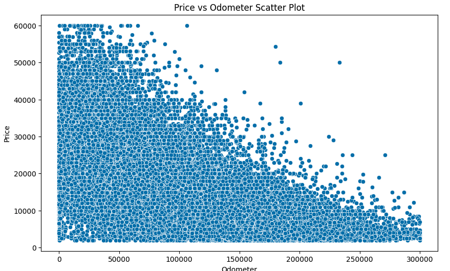
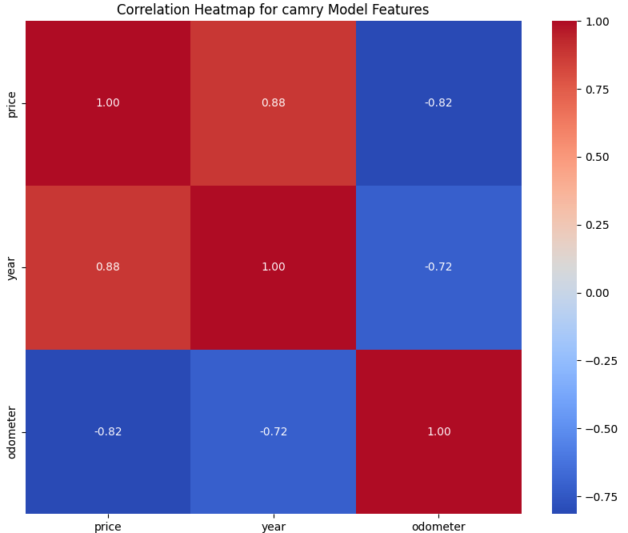
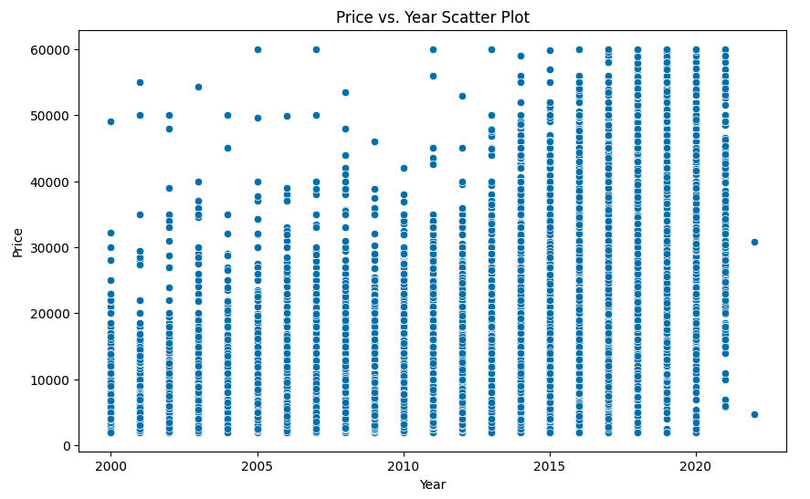
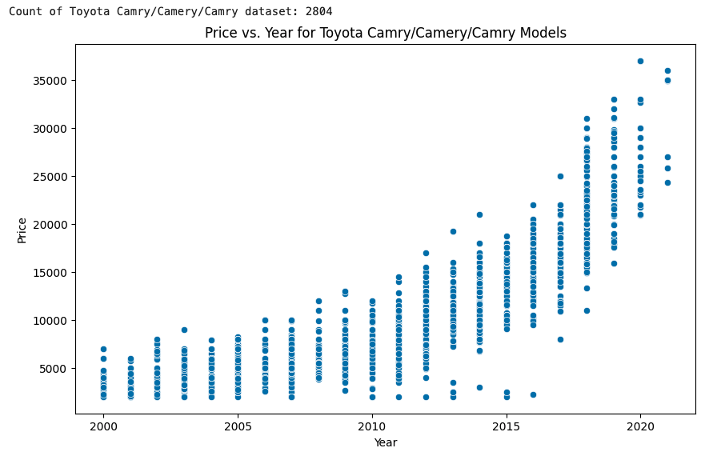

# Introduction - Used Car Prices

This project explores a dataset of used cars to understand the factors that influence their price. The analysis follows the CRISP-DM framework, starting from understanding the business problem to data preparation and initial modeling.  In this project, we will use a Jupyter notebook (included) to complete the exercise to analyse Kaggle used car data in [vehicles.csv](https://www.kaggle.com/datasets/austinreese/craigslist-carstrucks-data) file in the data folder (can be downloaded and uploaded into data folder for execution) to build a machine learning application that evaluates if vehicles features like Fuel, Condition, Size, Type, manufacturer, year etc. have an impact on vehicle price and can be used to determine used car prices. This evaluation will help the car dealers in maintaining inventory by stocking the cars which feature that sells more and procure them at an optimal price.

## Project Goal

The primary goal is to identify key drivers for used car prices and provide insights to a used car dealership on what consumers value in a used car.

## Dataset

The original dataset contained information on 3 million used cars. The provided dataset (Kaggle used car data in vehicles.csv ) contains information on 426K cars to ensure speed of processing. 

## CRISP-DM Framework

The project is structured around the CRISP-DM methodology:

1.  **Business Understanding:** Reframing the business problem of identifying price drivers into a data task.
2.  **Data Understanding:** Exploring the dataset to understand its structure, content, and potential quality issues.
3.  **Data Preparation:** Cleaning the data, handling missing values, removing outliers, and preparing the data for modeling. This involves:
    *   Dropping irrelevant columns.
    *   Handling missing values in various columns.
    *   Filtering out extreme price and odometer values.
    *   Separating premium and electric cars for potentially separate analysis.
    *   Filtering specific car types and manufacturers.
    *   Removing cars older than 2000.
    *   Focusing on 'gas' fuel type cars.
    *   Exploring average prices by year, transmission, drive type, and title status.
4.  **Modeling:** Building various regression models to predict car prices based on different feature sets.
5.  **Evaluation:** (To be added)
6.  **Deployment:** (To be added)

## Exploratory Data Analysis / Data Understanding and Data Preperation Details
The dataset has 426880 items in the beginning. Here are some observationas about the data:

1. There are many unrealistic values in pricing like "3736928711" or "1234567890" and many more. All these were deleted
2. Columns like 'id', 'VIN' etc. were deleted as they have no impact on the pricing
3. There were few cars with high odometer readings like 1000000. Deleted all items with more than 300000 odometer as it is considered outlier
4. Found and deleted a few cars with less than 100 odometer rating but are older than 2015
5. Setup a separate dataframe for all cars mor expensive than 100000. These can skew the data asthese are really pre,ium cars like Rools Royce and should be delt with separately
6. Moved electric cars and hybrid cars into a separate dataframe, to be delt with separately
7. Reduced dataset to car types 'SUV' 'hatchback' 'mini-van' 'sedan' 'wagon' 'van' for developing  models to predict price. Removed car types like trucks, pickup as those vehicles have a very different price range and must be dealt with separately
8. Drew box plots of average price vs Condition, Title Status and Trasmission which gives some obvious observations such as:
     1) Title status plays a role in car's price. Average price decreases with title status clean, lien, rebuilt, salvage, parts only and missing
     2) Condition plays a role in car's price. Average price decreases from new, good, like new, salvage and fair
     3) Transmission plays very little role in car's price. Automatic tranmission is slightly more expensive than manual transmission. But a lot of cars have status as "other" so this may change if accurate status is available for all cars

1. Price vs Odometer
    

    

    

    

## Analysis Highlights

*   Initial correlation analysis on a popular car model showed a positive correlation between year and price, and a negative correlation between odometer and price.
*   Data cleaning involved addressing missing values and removing potential outliers in price and odometer readings.
*   Exploratory analysis on subsets of the data (e.g., by transmission, drive type, title status) revealed potential relationships with price.
*   Initial linear regression models were built using:
    *   Odometer as a predictor.
    *   Odometer and year as predictors.
    *   Odometer, year, and one-hot encoded title status as predictors.

## Notebook Contents

The notebook contains the following sections:

*   **Business Understanding:** Defining the data task.
*   **Data Understanding:** Steps taken to explore the dataset and identify quality issues.
*   **Data Preparation:** Detailed steps for cleaning, filtering, and preparing the data. This includes:
    *   Loading the data.
    *   Handling missing values.
    *   Dropping rows based on price and odometer.
    *   Creating subsets for premium and electric cars.
    *   Filtering by car type and manufacturer.
    *   Analyzing average prices by various categories.
*   **Modeling:** Building and evaluating initial regression models.
    *   One hot encoding on categorical feature title_status 
    *   Linear Regression to predict price from Odometer.
    *   Multiple Linear Regression to predict price from Odometer and Year.
    *   Multiple Linear Regression to predict price from Odometer, Year, and Title Status.
    *   Lasso Regression to predict price from Odometer and Year.

## Getting Started

To run this notebook:

1.  Open the notebook in Google Colab.
2.  Ensure the `data/vehicles.csv` file is accessible in your Jupyter Notebook 
3.  Run the code cells sequentially.

## Dependencies

The notebook uses the following libraries:

*   `pandas`
*   `numpy`
*   `matplotlib`
*   `seaborn`
*   `sklearn`

These libraries are typically pre-installed in Google Colab.

## Conclusions and Insights

Based on the exploratory data analysis and initial modeling, the following conclusions can be drawn:

*   **Impact of Year and Odometer on Price:** The correlation heatmap for a specific model (Toyota Camry) and the scatter plots for the overall dataset clearly indicate a strong positive relationship between the car's `year` and its `price`, and a strong negative relationship between the `odometer` reading and its `price`. Newer cars with lower mileage tend to be more expensive, which aligns with general expectations in the used car market.
*   **Importance of Data Cleaning:** The initial data exploration revealed several issues, including missing values and extreme outliers in price and odometer readings. The data cleaning steps taken were crucial to ensure that the subsequent analysis and modeling were based on a more reliable dataset. The significant reduction in the number of rows after cleaning highlights the importance of this step.
*   **Categorical Features Matter:** The analysis of average prices across different categorical features like `transmission`, `drive`, and `title_status` suggests that these factors also influence car prices. For example, the average price variation based on `title_status` indicates that cars with certain title statuses might be significantly cheaper. Including these categorical features (through one-hot encoding) in the models is likely to improve prediction accuracy compared to using only numerical features.
*   **Model Improvement with More Features:** The progression from `model_1` (using only odometer) to `model_2` (adding year) and `model_3` (adding one-hot encoded title status) shows a likely improvement in model performance (although formal evaluation metrics across models would confirm this). This suggests that a combination of relevant numerical and categorical features is important for predicting used car prices.
*   **Potential for Segmentation:** The K-Means clustering visually suggests that cars can be grouped into distinct clusters based on features like price, odometer, and year. Analyzing the characteristics of these clusters could provide valuable insights for the used car dealership, potentially helping them segment their inventory or target specific customer groups. For example, one cluster might represent older, high-mileage, lower-priced cars, while another might represent newer, low-mileage, higher-priced vehicles.
*   **Need for Further Modeling and Evaluation:** The initial linear regression models serve as a starting point. More sophisticated models, feature engineering, and rigorous evaluation (including cross-validation and analysis of residuals) are needed to build a robust price prediction model.
*   **Specific Car Types and Manufacturers Influence Price:** The decision to remove certain car types (like trucks and luxury brands) and electric cars was based on the assumption that they might have different pricing dynamics. This implies that the type and manufacturer of a car are significant factors in determining its price and might warrant separate analyses or specific handling in the model.

## Future Work

*   Further feature engineering.
*   Exploring more advanced regression models (e.g., Ridge, Lasso, Polynomial Regression, tree-based models).
*   Hyperparameter tuning and cross-validation.
*   Comprehensive model evaluation using various metrics.
*   Analyzing the premium and electric car subsets.
*   Providing clear recommendations based on the analysis findings.
